# ChainFLIP

​[​​](https://user-images.githubusercontent.com/108946833/184274157-08210464-fa03-493d-b01c-2420c67a524f.jpg) [Twitter BeritaCryptoo](https://twitter.com/BeritaCryptoo) [​​](https://user-images.githubusercontent.com/50621007/183283867-56b4d69f-bc6e-4939-b00a-72aa019d1aea.png) [Telegram BeritaCryptoo](https://t.me/BeritaCryptoo) [​​](https://user-images.githubusercontent.com/108946833/201040868-61a5cfb9-f39e-4fd1-a3a6-2c15c1b47424.png) [Discord BeritaCryptoo](https://discord.gg/beritacryptoonode)​

<figure><figcaption></figcaption></figure>


Hapus seluruh `<>` jika ada command yang perlu di edit


### Official Link

* [Discord](https://discord.gg/C3AfDPVBKP)
* [Twitter](https://twitter.com/chainflip)
* [Telegram](https://t.me/chainflip\_io\_chat)
* [Docs](https://docs.chainflip.io/perseverance-validator-documentation/)

### Minimum Requirements

> OS: **Ubuntu 20.04** - <mark style="color:red;">**HANYA BISA DI UBUNTU 20.04**</mark>&#x20;
>
> * CPU: 4 GHz | 4+ Cores, Dedicated is better
> * RAM: 8 GB SSD: 50 GB (this may increase over time)&#x20;
> * Bandwidth: Recommended 1GBps connection, 100 GB bandwidth combined up/down per month

### 1. Port

```
sudo ufw allow ssh & sudo ufw allow 30333 && sudo ufw allow 8078 && sudo ufw enable
```

### 2. Create User

**a. Add user `flip`**

```
sudo useradd -s /bin/bash -d /home/flip/ -m -G sudo flip 
```

**b. Add password**

```
sudo passwd flip
```

> Masukan password baru yang mudah diingat, samakan dengan password VPS mu atau tanggal lahir terserah. **YANG PENTING JANGAN LUPA**

**c. Setup dasar untuk `flip`**

```
mkdir /home/flip/.ssh
sudo chown -R flip:flip /home/flip/.ssh/
sudo chmod 0700 /home/flip/.ssh/
```

* Untuk login menggunakan user `flip`

```html
ssh flip@<IP.VPS.MU>
```

IP.VPS.MU = ya IP VPS mu

* Berpindah dari `root` ke `flip`

```
su - flip
```

### 3. Download & Install Chainflip

**a. Download Chainflip GPG key**

```
sudo mkdir -p /etc/apt/keyrings
curl -fsSL repo.chainflip.io/keys/gpg | sudo gpg --dearmor -o /etc/apt/keyrings/chainflip.gpg
```

Verify

```
gpg --show-keys /etc/apt/keyrings/chainflip.gpg
```


Pastikan Output nya seperti di bawah


<figure>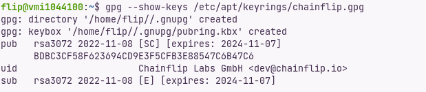<figcaption></figcaption></figure>

**b. Tambahkan Chainflip**

```
echo "deb [signed-by=/etc/apt/keyrings/chainflip.gpg] https://repo.chainflip.io/perseverance/ focal main" | sudo tee /etc/apt/sources.list.d/chainflip.list
```

**c. Install Chainflip**

```
sudo apt-get update
sudo apt-get install -y chainflip-cli chainflip-node chainflip-engine
```

### 4. Import Metamask Wallet

**a. Buat wallet baru di Metamask, isi dengan 0.1 ETH Goerli, lalu request faucet di Discord**

Jangan lupa untuk ambil role ,supaya bisa claim faucet

<figure>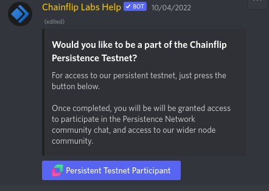<figcaption></figcaption></figure>

> !drip \<AddressMU>

**b. Buat folder keys**

```
sudo mkdir /etc/chainflip/keys
```

**c. Import wallet ke VPS**


<mark style="color:red;">**NEW WALLET**</mark> karena yang di import  Private Key, jadi jangan gunakan wallet utama

<mark style="color:red;">**HARUS**</mark> Private Key dari Metamask


```html
echo -n "<PRIVATE_KEY_MU>" |  sudo tee /etc/chainflip/keys/ethereum_key_file
```

> Ganti `<PRIVATE_KEY_MU>` dengan PrivKey mu
>
> Dan pastikan wallet yang di import adalah wallet yang berisi 0.1 Goerli dan yang digunakan untuk request faucet tadi

**d. Buat signin\_key**

```
chainflip-node key generate
```

Output:

```
Secret phrase:       never gonna give you up let you down make you cry round around
  Network ID:        2112
  Secret seed:       0x000000000000000000000000000000000000000  # This is your private key. Hold onto it.
  Public key (hex):  0x000000000000000000000000000000000000DEAD
  Account ID:        0x000000000000000000000000000000000000DEAD 
  Public key (SS58): cFAzeakmiHesoyamAbogoboga # This is your Validator ID. Make sure you have it handy for staking.
  SS58 Address:      cFAzeakmiHesoyamAbogoboga
```


<mark style="color:red;">**BACKUP**</mark>


**e. Simpan signin\_key**

```html
SECRET_SEED=<SECRET_SEED Tanpa 0x>
```

```
echo -n "${SECRET_SEED:2}" | sudo tee /etc/chainflip/keys/signing_key_file
```

**f. Generate node\_key**

```
sudo chainflip-node key generate-node-key --file /etc/chainflip/keys/node_key_file
```

untuk melihat `node_key` gunakan command

```
cat /etc/chainflip/keys/node_key_file
```

**g. Backup folder** `/etc/chainflip/keys/`

**h. Hapus permission user lain**

```
sudo chmod 600 /etc/chainflip/keys/ethereum_key_file
sudo chmod 600 /etc/chainflip/keys/signing_key_file
sudo chmod 600 /etc/chainflip/keys/node_key_file
history -c
```

### 5. Membuat Config

**a. Register Alchemy**

****[**DISINI**](https://dashboard.alchemy.com/)****

**b. Create App**

**c. Pilih Chain Ethereum dan Network Goerli (Nama dan Deskripsi bebas)**

<figure><figcaption></figcaption></figure>

**d. Masuk ke App**

**e. Klik View Key dan simpan ke notepad**

<figure>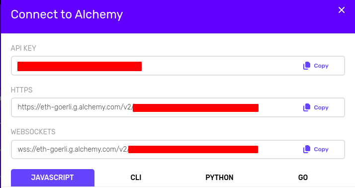<figcaption></figcaption></figure>

**Tambahan**: Yang `https` itu bisa digunakan untuk RPC URL di metamask


Jangan berikan kepada siapapun karena itu RPC + API Keys pribadi mu


**f. Kembali ke VPS dan pastikan masih menggunakan user** `flip` **bukan** `root`

**g. Buat folder dan file baru**

* Buat folder config

```
sudo mkdir -p /etc/chainflip/config
```

* Buat file `Defaul.toml`

```
sudo nano /etc/chainflip/config/Default.toml
```

&#x20;  Isi menggunakan ini

```markup
# Default configurations for the CFE
[node_p2p]
node_key_file = "/etc/chainflip/keys/node_key_file"
ip_address="IP.VPS.MU"
port = "8078"

[state_chain]
ws_endpoint = "ws://127.0.0.1:9944"
signing_key_file = "/etc/chainflip/keys/signing_key_file"

[eth]
# Ethereum RPC endpoints (websocket and http for redundancy).
ws_node_endpoint = "wss://dari-alchemy"
http_node_endpoint = "https://dari-alchemy"

# Ethereum private key file path. This file should contain a hex-encoded private key.
private_key_file = "/etc/chainflip/keys/ethereum_key_file"

[signing]
db_file = "/etc/chainflip/data.db"
```

> * Ganti `IP.VPS.MU` dengan IP VPS mu
> * Ganti  `wss://dari-alchemy` dengan link WEBSOCKETS mu dari alchemy
> * Ganti `https://dari-alchemy` dengan link HTTPS mu dari alchemy

Simpan. CTRL+X , Y , Enter

### 6. Start Node

**a. Memulai** `chainflip-node` **gunakan**

```
sudo systemctl start chainflip-node
```

**b. Cek status**

```
sudo systemctl status chainflip-node
```

<figure>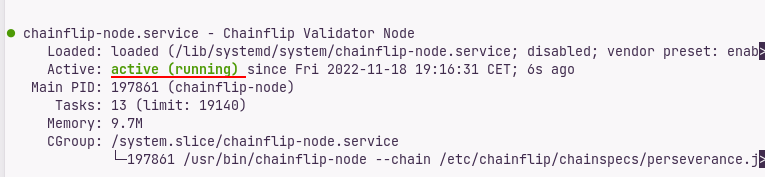<figcaption></figcaption></figure>

Gunakan `CTRL+C` untuk close

**c. Cek logs**

```
tail -f /var/log/chainflip-node.log
```

Jika seperti ini , berarti belum sync

<figure>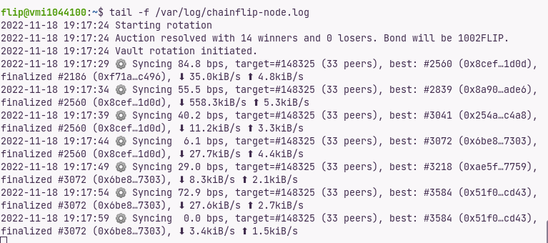<figcaption></figcaption></figure>


<mark style="color:blue;">**Jangan**</mark> lanjut ke next step kalau belum sync, itu akan membuat `chainflip` nya <mark style="color:red;">crash</mark>


Jika sudah sync , logs nya akan seperti ini

<figure>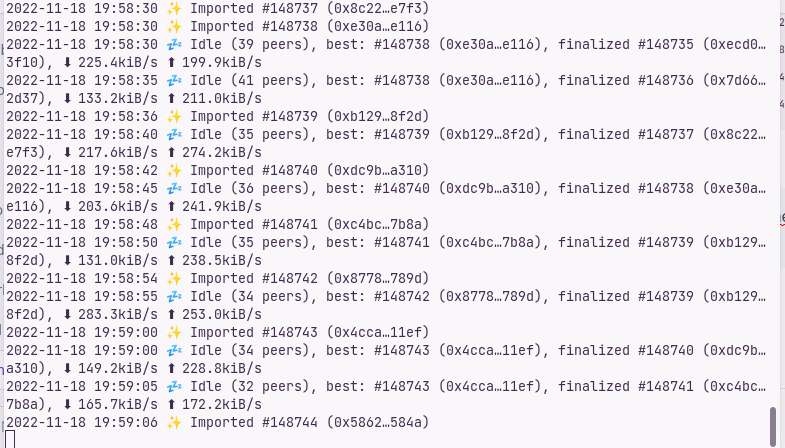<figcaption></figcaption></figure>

### 7. Start Engine

**a. Mulai** `chainflip-engine` **menggunakan command**

```
sudo systemctl start chainflip-engine
```

**b. Cek status**

```
sudo systemctl status chainflip-engine
```

<figure>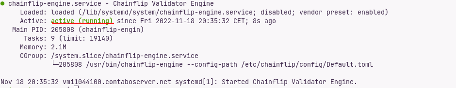<figcaption></figcaption></figure>

### 8. Aktifkan

```
sudo systemctl enable chainflip-node
```

<figure>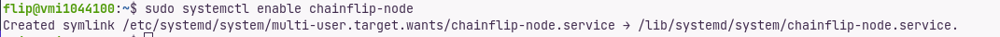<figcaption></figcaption></figure>

```
sudo systemctl enable chainflip-engine
```

<figure>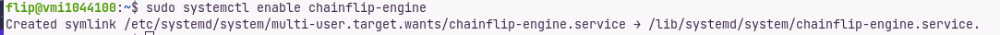<figcaption></figcaption></figure>


Setiap melakukan perubahan pada `Default.toml` harus jalankan :&#x20;

```
sudo systemctl restart chainflip-engine
```


**Cek logs engine**

```
tail -f /var/log/chainflip-engine.log
```

Logs Sebelum Stake

<figure>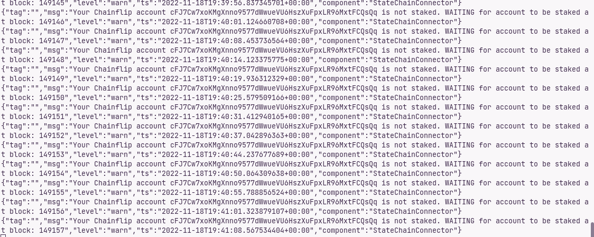<figcaption></figcaption></figure>

### 9. Stake

**a. Pergi ke Dashboard**

****[**DISINI**](https://stake-perseverance.chainflip.io/)****

Connect menggunakan wallet yang digunakan untuk req faucet tadi

**b. Klik My Node**

**c. Lalu Pilih +Add Node**

**d. Masukan** `Public key (SS58)` dari generate node\_key tadi

<figure>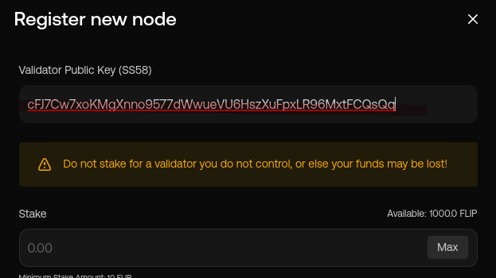<figcaption></figcaption></figure>

**e. Stake tFLIP**

**f. Dan ya, gitu**

<figure>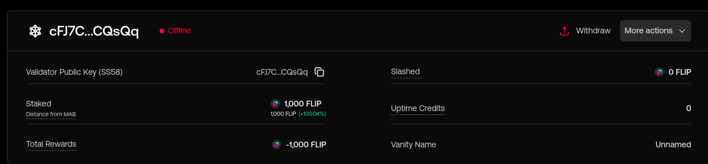<figcaption></figcaption></figure>

**g. Register Node agar aktif**

```
sudo chainflip-cli \
      --config-path /etc/chainflip/config/Default.toml \
      register-account-role Validator
```

<figure><figcaption></figcaption></figure>

Y , enter

**h. Aktifasi**

```
sudo chainflip-cli \
    --config-path /etc/chainflip/config/Default.toml \
    activate
```

**i. Masuk rotasi**

```
sudo chainflip-cli \
    --config-path /etc/chainflip/config/Default.toml rotate
```

**j. Ubah nama**

```html
sudo chainflip-cli \
    --config-path /etc/chainflip/config/Default.toml \
    vanity-name <NAMA_MU>
```

### OK!

<figure>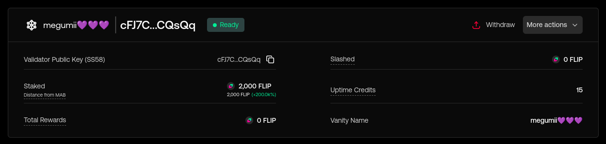<figcaption></figcaption></figure>

### Tambahan agar file logs terpisah sesuai hari

**a. Cek logrotate**

```
logrotate
```

Jika sudah ada maka seperti ini

```
logrotate 3.14.0 - Copyright (C) 1995-2001 Red Hat, Inc.
This may be freely redistributed under the terms of the GNU General Public License

Usage: logrotate [-dfv?] [-d|--debug] [-f|--force] [-m|--mail=command]
        [-s|--state=statefile] [-v|--verbose] [-l|--log=logfile] [--version]
        [-?|--help] [--usage] [OPTION...] <configfile>
```

**b. Konfigurasi chainflip ke logrotate**

```
sudo nano /etc/logrotate.d/chainflip
```

Isi dengan ini

```
/var/log/chainflip-*.log {
  rotate 7
  daily
  dateext
  dateformat -%Y-%m-%d
  missingok
  notifempty
  copytruncate
  nocompress
}
```

Simpan

**c. Berikan izin ke root**

```
sudo chmod 644 /etc/logrotate.d/chainflip
sudo chown root.root /etc/logrotate.d/chainflip
```

