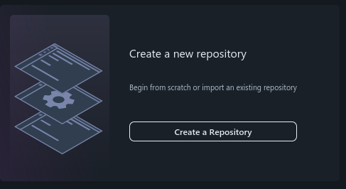
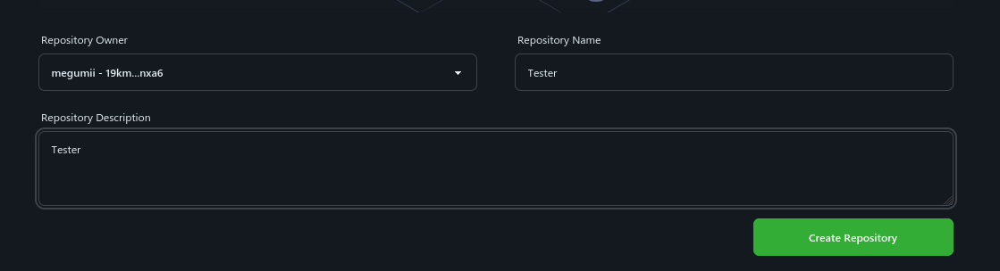
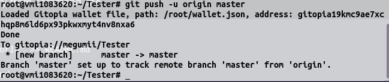
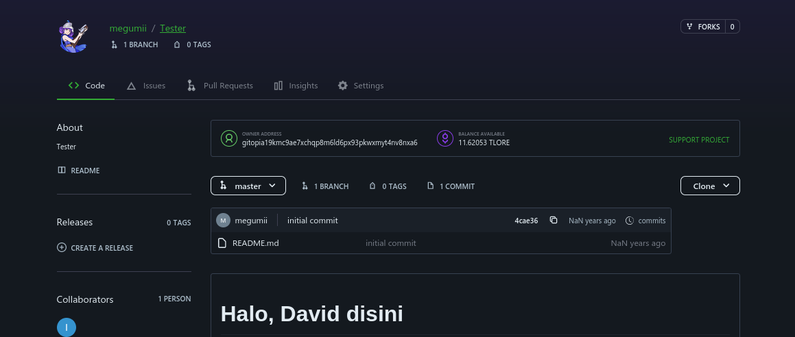

# Membuat Repo dari 0

### 1. Buka




<mark style="color:red;">**Jangan**</mark> Connect Wallet Keplr


### 2. Pilih Recover

<figure><figcaption></figcaption></figure>

### 3. Masukan Pharse 24 Kata dari wallet VPS

### 4. Buat Profil (Kalo belom)

### 5. Create a Repository

<figure><figcaption></figcaption></figure>

Nama bebas, deskripsi bebas

<figure><figcaption></figcaption></figure>

#### Selanjutnya, masuk ke VPS

### 6. Install Git-Remote

```
curl https://get.gitopia.com | bash
```

### 7. Buat Folder baru sesuai dengan nama Repository

```
mkdir NamaRepo
```

### 8. Import Wallet

**a. Download Wallet di dashboard**

<figure><figcaption></figcaption></figure>

**b. Buat file .json di VPS**

```
nano wallet.json
```

**c. Buka file wallet yang tadi di download**

**d. Copy isinya**

**e. Paste ke VPS**

Save, CTRL+X Y Enter

**f. Cek untuk memastikan**

```
cat wallet.json
```

<figure><figcaption></figcaption></figure>

### 9. Mulai membuat Repository

**a. Masuk ke folder**

```
cd NamaRepo
```

**b. Tambahkan detail**

```
git config --global user.email "EmailMU"
git config --global user.name "NamaAkunMU"
```

Cek

```
git config -l
```

<figure><figcaption></figcaption></figure>

**c. Buat isi Repository**

```
echo "# Halo, David disini" >> README.md
git init
git add README.md
git commit -m "initial commit"
```

> `Halo, David disini` diganti dengan kata-kata terserahmu

**d. Export file Wallet**

```
export GITOPIA_WALLET=/root/wallet.json
```

### 10. Upload ke Gitopia

**a. Kembali ke web**

**b. Copy command**

<figure><figcaption></figcaption></figure>

**c. Paste ke VPS**

**d. OK!**

<figure><figcaption></figcaption></figure>

### **Cek di web**

<figure><figcaption></figcaption></figure>

