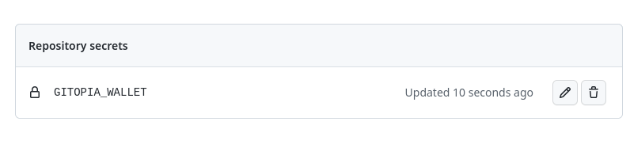
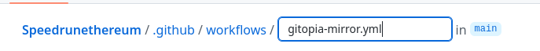
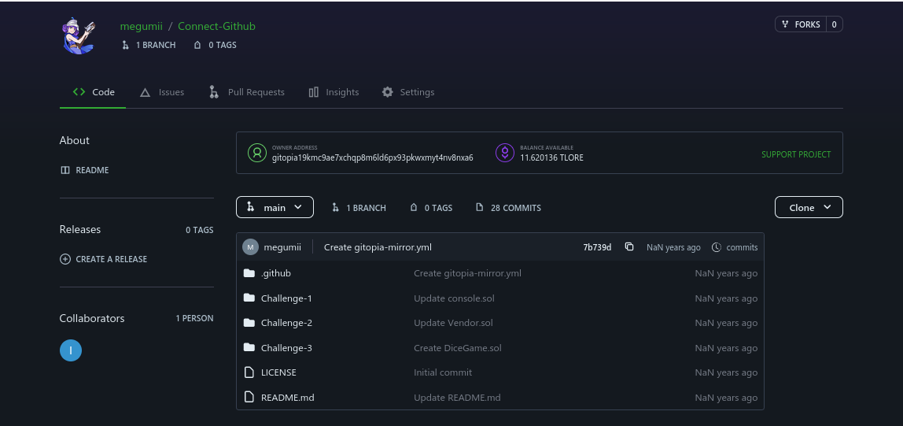
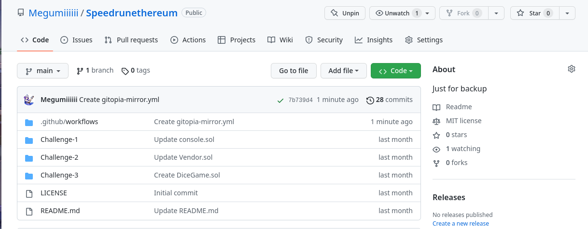

# Menghubungkan Repo di Github dengan Gitopia

## Official Docs



<mark style="color:red;"><mark style="color:orange;"><mark style="color:green;">**Pastikan sudah memiliki akun GitHub**<mark style="color:green;"><mark style="color:orange;"></mark>

### 1. Fork Repository

* [https://github.com/Megumiiiiii?tab=repositories](https://github.com/Megumiiiiii?tab=repositories)
* [https://github.com/xsons?tab=repositories](https://github.com/xsons?tab=repositories)
* Atau buat repo sendiri, **BEBAS**

### 2. Create a Repository di Gitopia

Nama Bebas

<figure><figcaption></figcaption></figure>

### 3. Masuk ke repository Github mu yang ingin dihubungkan

### 4. Klik Setting

<figure><figcaption></figcaption></figure>

### 5. Scroll dan Masuk ke Secret -> Action

<figure><figcaption></figcaption></figure>

### 6. Pilih New Secret

<figure><figcaption></figcaption></figure>

### 7. Beri nama dan masukan isi

* Nama:

```
GITOPIA_WALLET
```

* Isi menggunakan data dari wallet yang di download dari tutor sebelumnya. [Tutor Sebelumnya](https://beritacryptoo.gitbook.io/node/gitopia/membuat-repo-dari-0)

<figure><figcaption></figcaption></figure>

Gitu

<figure><figcaption></figcaption></figure>

### 8. Lanjut ke Action

<figure><figcaption></figcaption></figure>

### 9. Pilih Simple workflow

<figure><figcaption></figcaption></figure>

**a. Ganti nama file .yml**

Dari `blank.yml`

<figure><figcaption></figcaption></figure>

Menjadi `gitopia-mirror.yml`

<figure><figcaption></figcaption></figure>

**b. Hapus isinya**

**c. Ganti dengan ini**

```
name: Mirror to Gitopia

on:
  push:
    branches:
      - '**'

jobs:
  build:
    runs-on: ubuntu-latest

    steps:
      - uses: actions/checkout@v2
        with:
          fetch-depth: 0
      - name: Push to Gitopia mirror
        uses: gitopia/gitopia-mirror-action@v0.5.0
        with:
          gitopiaWallet: "${{ secrets.GITOPIA_WALLET }}"
          remoteUrl: "link-repo-gitopia-mu"
          force: false

```

`link-repo-gitopia-mu` ganti dengan link dari sini

<figure><figcaption></figcaption></figure>

Isi file `.yml` sekarang

<figure><figcaption></figcaption></figure>

**d. Klik Start Commit**

<figure><figcaption></figcaption></figure>

### **10. Kembali ke web gitopia**

### **11. Refresh dan Cek hasilnya**

<figure><figcaption></figcaption></figure>

<figure><figcaption></figcaption></figure>


### **Fork Repository di Gitopia**

* [https://gitopia.com/BeritaCryptooDAO/Testnet-Tutorial](https://gitopia.com/BeritaCryptooDAO/Testnet-Tutorial)
* [https://gitopia.com/megumii/Guide-Testnet](https://gitopia.com/megumii/Guide-Testnet)
* [https://gitopia.com/megumii/Connect-Github](https://gitopia.com/megumii/Connect-Github)
