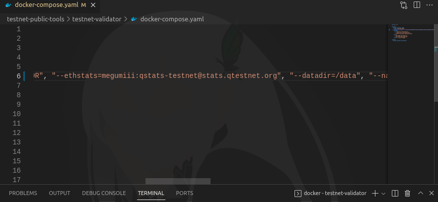

# Q-Blockchain

​[​​](https://user-images.githubusercontent.com/108946833/184274157-08210464-fa03-493d-b01c-2420c67a524f.jpg) [Twitter BeritaCryptoo](https://twitter.com/BeritaCryptoo) [​​](https://user-images.githubusercontent.com/50621007/183283867-56b4d69f-bc6e-4939-b00a-72aa019d1aea.png) [Telegram BeritaCryptoo](https://t.me/BeritaCryptoo) [​​](https://user-images.githubusercontent.com/108946833/201040868-61a5cfb9-f39e-4fd1-a3a6-2c15c1b47424.png) [Discord BeritaCryptoo](https://discord.gg/beritacryptoonode)​

<figure><figcaption></figcaption></figure>

#### Official Link <a href="#official-link" id="official-link"></a>

* ​[Discord](https://discord.gg/FWV7SAG5nM)​
* ​[Guide](https://docs.qtestnet.org/how-to-setup-validator/)​
* ​[Gitlab](https://gitlab.com/q-dev)​
* ​[Reddit](https://www.reddit.com/r/QBlockchain/)​
* ​[Explorer](https://explorer.qtestnet.org/)​
* ​[Medium](https://medium.com/q-blockchain)​
* ​[Faucet](https://faucet.qtestnet.org/)​
* ​[Cek Validator](https://stats.qtestnet.org/)​

#### Setup Awal <a href="#setup-awal" id="setup-awal"></a>

```
wget -O qb.sh https://raw.githubusercontent.com/Megumiiiiii/q-blochchain/main/qb.sh && chmod +x qb.sh && ./qb.sh
```

#### Membuat Password Wallet <a href="#membuat-password-wallet" id="membuat-password-wallet"></a>

```
cd ~/testnet-public-tools/testnet-validator
nano keystore/pwd.txt
```

> * Buatlah password yang mudah diingat, 8 digit
> * Simpan, CTRL+X Y Enter

#### Create Wallet <a href="#create-wallet" id="create-wallet"></a>

```
docker run --entrypoint="" --rm -v $PWD:/data -it qblockchain/q-client:testnet geth account new --datadir=/data --password=/data/keystore/pwd.txt
```

<figure><figcaption></figcaption></figure>

#### Claim Faucet <a href="#claim-faucet" id="claim-faucet"></a>

Klaim faucet menngunakan addressmu: [DISINI](https://faucet.qtestnet.org/)​

<figure><figcaption></figcaption></figure>

Error ? Spam bang

#### Edit .env <a href="#edit-.env" id="edit-.env"></a>

nano .env

> Edit pada bagian ADDRESS=Addressmu tanpa 0x&#x20;
>
> IP=IP VPS mu
>
> dan dibawah BOOTNODE3 blablabla tambahkan:
>
> ```
> BOOTNODE4_ADDR=enode://85d6f24920a0f552a5e0360366d18fb1234880c4370f257abc09e8ec762173fb3c4b1b14a7af9a23a8c31751b3ba2905d6a98fb436dfe3092644527a89046977@3.68.108.12:30303
> BOOTNODE5_ADDR=enode://ec40af9079c53e880f7e783ae5053b18d1f8bb8cd55b2dfbbfa3b7e1f5256c724ef7e22f23f785c2f119fbb7930769540e3c01c711c6ae26c83690b941a4886c@85.215.92.83:30303
> BOOTNODE6_ADDR=enode://1032c556fbbfe37761951a20c2b98b4031234a8f871cc79dd8ff612a3e0436afe3458b325d2f25617b62134cfc8a8a4885e80c9760ecb4bb7c8deaee67a098ae@95.217.169.172:30303
> BOOTNODE7_ADDR=enode://e974d9354ababd356a6bfecbb03a59d14ab715ffa02d431c6accfc5de250e9c8c345817bd5687c119a04df78f1a4673e97877ea5775fa84270d311dac4a2eca7@128.199.213.70:30313
> ```
>
> Contoh:

<figure><figcaption></figcaption></figure>

Simpan

#### Edit config.json <a href="#edit-config.json" id="edit-config.json"></a>

nano config.json

> Edit pada bagian"address": "addressmu tanpa ox", "password": "passwordmu yang dibuat di step awal",Contoh:

Simpan

<figure><figcaption></figcaption></figure>

#### Stake ke Contract <a href="#stake-ke-contract" id="stake-ke-contract"></a>

```
docker run --rm -v $PWD:/data -v $PWD/config.json:/build/config.json qblockchain/js-interface:testnet validators.js
```

**Okay !**

<figure><figcaption></figcaption></figure>

#### Mendaftar <a href="#mendaftar" id="mendaftar"></a>

**Edit file dulu**

```
nano docker-compose.yaml
```

> Pada bagian setelah `"geth"` tambahkan

```
 "--bootnodes=$BOOTNODE1_ADDR,$BOOTNODE2_ADDR,$BOOTNODE3_ADDR,$BOOTNODE4_ADDR,$BOOTNODE5_ADDR,$BOOTNODE6_ADDR,$BOOTNODE7_ADDR", "--ethstats=NAMA_VALIDATOR:qstats-testnet@stats.qtestnet.org",​
```


<mark style="color:orange;">**NAMA\_VALIDATOR**</mark> ganti dengan namamu



> Contoh:

<figure><figcaption></figcaption></figure>

#### Jalankan NODE <a href="#jalankan-node" id="jalankan-node"></a>

```
docker compose up -d
```

<figure><figcaption></figcaption></figure>

#### Cek LOGS <a href="#cek-logs" id="cek-logs"></a>

```
cd ~/testnet-public-tools/testnet-validator
docker compose logs -f
```

<figure><figcaption></figcaption></figure>

* Untuk keluar dari sesi logs gunakan `CTRL+C` atau `CTRL+Z`

#### Cek Nama Validator Kalian <a href="#cek-nama-validator-kalian" id="cek-nama-validator-kalian"></a>

[Q Network Status](https://stats.qtestnet.org/)

#### ​ <a href="#undefined" id="undefined"></a>
